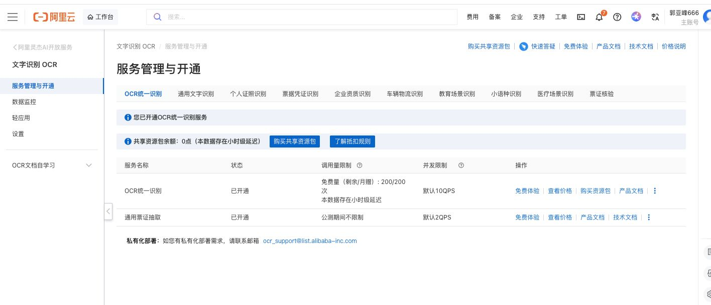

1 ❯ 这个项目我用了阿里云ocr 现在识别图片还报错 OCR 识别失败：OCR识别失败：阿里云API调用失败:  
{"RequestId":"DD8B06AC-D9E3-5E8F-B3E1-0DF252251696","Message":"Specified api is not found, please check your url
and method.","Recommend":"https://api.aliyun.com/troubleshoot?q=InvalidAction.NotFound&product=ocr&requestId=DD
8B06AC-D9E3-5E8F-B3E1-0DF252251696","HostId":"ocr.cn-

⏺ 已修复代码。主要修改包括：

1. Action 名称: RecognizeGeneral → RecognizeGeneralText
2. 请求格式: 从 form-urlencoded 改为 JSON 格式
3. 签名传递: 使用 Authorization: acs:{AccessKeyId}:{Signature} header 方式

但是，阿里云 OCR API 的调用方式其实有更简单的方法。让我检查一下你是否有使用阿里云官方  
 SDK，或者是否需要使用更简单的调用方式：

主要修改：

1. 使用 SDK 替代手动签名 - 使用 @alicloud/pop-core SDK 自动处理签名和请求
2. 简化配置 - 只需传入 accessKeyId、accessKeySecret、endpoint 和 apiVersion
3. 简化请求体 - 直接使用 client.request('RecognizeGeneralText', params) 调用

2 OCR 识别失败：OCR 识别失败："config.endpoint" must starts with 'https://' or 'http://'.

⏺ 错误很明显，SDK 的 endpoint 需要包含协议前缀。让我修复：

⏺ Update(app/api/ocr/recognize/route.ts)
⎿  Added 1 line, removed 1 line  
 47 const client = new RPCClient({  
 48 accessKeyId,  
 49 accessKeySecret,  
 50 - endpoint: 'ocr.cn-shanghai.aliyuncs.com',  
 50 + endpoint: 'https://ocr.cn-shanghai.aliyuncs.com',  
 51 apiVersion: '2019-12-30',  
 52 });  
 53

⏺ 已修复，endpoint 现在加上了 https:// 前缀。请重新测试 OCR 功能。

3 OCR 识别失败：OCR 识别失败：Specified api is not found, please check your url and method., URL: https://ocr.cn-shanghai.aliyuncs.com/

4

---

OCR 识别失败：OCR识别失败：ENOENT: no such file or directory, open '/tmp/ocr_1774752216165.png'

OCR 识别失败：OCR识别失败：Specified api is not found, please check your url and method., URL: https://ocr.cn-shanghai.aliyuncs.com/

OCR 识别失败：OCR识别失败：Specified api is not purchased, open the link to purchase api: https://help.aliyun.com/document_detail/465341.html, URL: https://ocr.cn-shanghai.aliyuncs.com/

最后使用vscode 自带的模型 把这个问题解决了 找到了 真正的原因
我使用的是 Raptor mini (Preview)。

